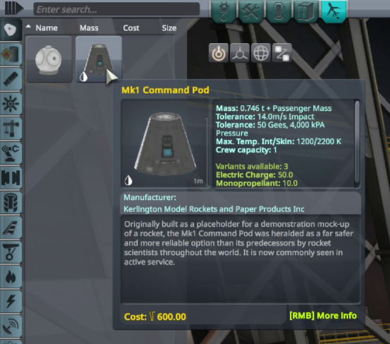
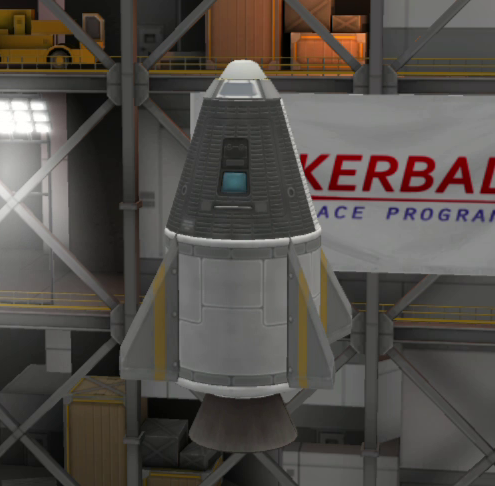
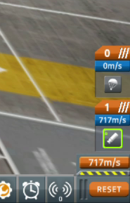
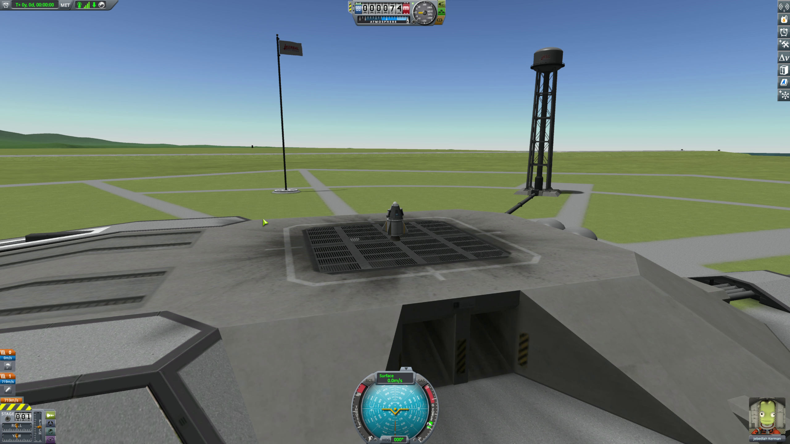

# Chapter 1: The Tyranny of the Rocket Equation

## 1. Introduction
### The Dream of Flight
For ages, mankind has looked up and wondered, "Why am I stuck down here?" We quickly developed, and excelled at, horizontal mobility. The vertical plane, however, has nearly always escaped us. Even the Wright Brothers struggled to go "up". It turns out they just traveled horizontally and let the Earth get out of the way a bit. 


It's only the past 65 or so years that we figured out how to get from the surface of our planet past the reaches of our atmosphere. Just as early explorers were captivated by the expanse of the oceans, today we are captivated by the even more vast expanse of Outer Space. Our imaginations are filled with the endless possibilities of what _may_ be, in the places we cannot see. Many of us _long_ to explore there.

### The Antagonist
In this soul-deep quest for exploration, we have a singular adversary. **Gravity**. This is our nemesis which traps us on the surface of Earth. It is due to Gravity that we cannot escape vertically, and even the horizontal poses several challenges. Gravity is this literal force of nature that draws objects together. Anything that has mass has gravity. The more mass something has, the more its gravitational force affects other objects. The Earth, being _big_, exerts a lot of gravitational force on you and me. You and I, being small, exert a tiny bit of gravitational force on the Earth.

The closer things are to each other, the stronger their gravitational forces attract each other. Earth is very close to you, so you are affected by its gravity far more than you are affected by the gravity of the Sun, even though the sun is approximately 333,000 times as massive as the earth. You can't even really feel the pull of the sun, because of our close proximity to the Earth. But, therein lies the chink in the armor of our enemy, Gravity. The further we are from an object, the less we are affected by its gravitational pull. In theory, if we were to fight very hard against the gravity of Earth, just for a bit, we could get far enough away to where we wouldn't have to fight as hard. A bit further away, and we would barely have to fight Earth's gravity at all. Still further, we would hardly remember what Earth's gravity felt like, and we wouldn't feel any significant gravity. Incidentally, we would likely no longer have a concept of "up", since "up" usually means "the direction Gravity wants to stop me from going."

So there we have our foe: **Gravity**. The remainder of this book will be about various strategies and tactics of conquering our foe.

Let's learn what we need to know to accomplish our first mission!

> [!IMPORTANT]
> **Mission 1:** The Flea Jump
> **Objective:** Design, build, and launch a vessel, break the sound barrier, and land safely.
> **Why:** To prove that we can strike a vital blow against Gravity, and survive the engagement.

## 2. The Science: Why Rockets Fly
### Newton's Third Law
Isaac Newton is known for many things. Of those things, three are relevant to us: **Newton's Laws of Motion**

1. An object at rest remains at rest, and an object in motion remains in motion at constant speed and in a straight line unless acted on by an unbalanced force.
2. The acceleration of an object depends on the mass of the object and the amount of force applied.
3. Whenever one object exerts a force on another object, the second object exerts an equal and opposite on the first.

Of these three things, **#3** is the one we want to zoom in on for this section. If we have two objects, and one exerts a force on the second, the second object exerts an equal and opposite force on the first. Does that mean that if you push a car, the car pushes back? Yes! If you pull a rope, the rope pulls back? Absolutely! If you punch a bear, the bear punches you? Maybe. He might bite you, but that's not relevant. How is this "equal and opposite" law useful? Let's talk about an example.

Let's say you're standing on a skateboard, and let's also say you have perfect balance. Assume that your skateboard bearings are very well greased, and you are on very smooth, flat ground. That is to say, your skateboard rolls _very easily_. Now, let's say you are also holding a bowling ball. If you give that bowling ball a big shove, it will move away from you at some specific velocity. You have exerted a force on that ball. Due to Newton's Third Law, the ball has also exerted a force on _you_, in an equal and opposite amount. So while the ball moves away from you, you also start rolling in the opposite direction. Presumably, you are rolling slower, but this is because you have more mass. You might have seen the equation before:

$f=ma$

which means:

$\text{Force} = \text{Mass} \times \text{Acceleration}$

We can rewrite this to be:

$\text{Acceleration} = \frac{\text{Force}}{\text{Mass}}$

Let's apply one of these equations to me, and one to the ball.

Knowing that Newton's Third Law says that the amount of force I exert on the ball is the same as the force that ball exerts on me, we can assume that _Force_ in both these equations is the same. Since my mass is greater than that of a bowling ball (and yours, presumably, is too), we can conclude that my Acceleration will be lower, because my mass is higher, when compared to the bowling ball.

That's great for a single, big push. Maybe if we were strong enough, and had a big enough bowling ball, and we pushed it straight down, we could, effectively push ourselves directly into space. But a single force strong enough to launch us into space would, presumably, tear our bodies apart before we left the atmosphere. And if we did manage to leave it, what would we breathe when we got there?!

Let's expand on this bowling ball idea a bit.

Climbing back on our skateboard, we ditch the bowling ball in favor of a backpack full of baseballs. Now, instead of a big, single push of a bowling ball, we toss a baseball, every few seconds, in the same direction. The first baseball moves away pretty quickly, and we slightly start to roll in the opposite direction. But hey, at least we're moving! So we throw another ball. And we ```f=ma```ccelerate a little quicker. And we toss another ball, and speed up a little more. And so on and so on, until we're out of baseballs. So we gradually continue to speed up, saving our fragile bag of meat and bones that huge initial shock of a singular, sudden force.

### Newton's Rockets
How does Newton's Third Law apply to rockets and spaceflight? Let's replace our baseballs with a flammable substance. It can be either a liquid fuel, or some solid that burns. When things burn, they expand. So if you burn them in an enclosed space that has a hole in one direction, the burnt fuel will "expand" out through that hole. For now, let's call that an "engine". The engine is effectively pushing that burnt fuel away from it. If we told that to Sir Isaac Newton, he would make a ridiculous claim that the burnt fuel was pushing back against the engine! _But he would be correct!_ That small engine would push our skateboard, starting slowly, and rapidly accelerating until the fuel was all burnt up!

Now, if we turn that engine 90 degrees and then sit on top of it, we'll have a rocket! But is this rocket strong enough to actually achieve liftoff? We need to combine some concepts here. We talked about gravity, and the force that it exerts on objects with mass. So our goal is to have our burnt fuel pushing us with slightly more force than the force of gravity. You'll notice that when you drop something, it starts moving slowly, but it _accelerates_. This is called the **acceleration of gravity**. This has been measured on the planet Earth, with objects that have proportionally much less mass than Earth such as cars, rocks, bowling balls, and even Australians. This is important to note because we can assume that the object's gravitational acceleration on Earth is so small it can be considered 0 for our calculations. Meanwhile, the Earth's gravitational acceleration on the object will be significant! So, this measured **acceleration of gravity** has been found to be **9.8 meters per second, per second**. Meaning that each second, an object caught near Earth, under Earth's gravitational influence, will travel 9.8 meters per second faster toward earth than it did the second before.

_That_ is the amount of acceleration that we need to overcome in order to achieve "liftoff". With that as our target, and knowing the mass of the fuel we are burning, we know how much force we need to exert. Now, we're going to come up with a new term for this. Just like we were throwing baseballs before, and now we're throwing burnt fuel in the form of a gas, we will call this force "Passing Gas". Actually, since that term is already taken, let's call this "**Thrust**". Thrust is the "Equal and Opposite" reaction force created by our engine.

How big is a Thrust? Well, since this is all the fault of Sir Isaac Newton, let's name our units after him. And we will define **one Newton** as the amount of thrust required to accelerate a single kilogram at the rate of meter per second, per second. Remember our gravitational force of 9.8 meters per second, per second? We're going to try and keep our units similar to each other so that we can link our concepts, and make our maths easier. So now we've defined **thrust** in terms of **Newtons**. Also, let's rename "meters per second, per second" to "$\text{m/s}^2$", since that's shorter to type and read.

### Thrust-to-Weight Ratio (TWR)
To truly lift off the launchpad, our rocket's engines need to produce more force than gravity is pulling it down. This relationship is captured by the **Thrust-to-Weight Ratio (TWR)**. Remember, the problem that we're trying to solve is to determine how much force we need to apply in order to overcome the $9.8 \text{m/s}^2$ gravitational acceleration of Earth. We haven't talked about **weight**, much so let's define that real quick. First off, Mass is the amount of matter in an object. It doesn't change, based on where the object is. **Weight** is the effect of gravitational acceleration on that object's mass. So, two objects on the surface of earth (meaning they both have $9.8 \text{m/s}^2$ acceleration acting on them) that have different amounts of matter in them will have different weights. I have more matter in me than my wife has in her, which is why she reminds me to eat healthier and work out consistently. _I weigh more_. That's also why you weigh less the further away from the earth you are. Remember that the further you are from an object, the less its gravitational acceleration will affect you. So the further from Earth you are, the less you weigh.

Now we have all the knowledge bits needed to figure out if a rocket engine can achieve liftoff. Basically, the **thrust** of the engine has to be greater than the **weight** of the engine. The ratio of the thrust to the weight is, quite obviously named, the **Thrust-to-Weight Ratio** or **TWR**. This is a _magic number_ for engines. Basically, if that ratio is greater than 1.0, there will be enough thrust to push the engine off the surface of the Earth, or whatever planet we happen to be on. I don't discriminate. As a side fact, we can tape some other stuff onto the top of the engine, which adds weight, but doesn't increase our thrust. So that lowers our TWR. As long as that TWR is still greater than 1.0, the engine can still lift off, carrying whatever is taped to it. Even a human, or Australian.

The other interesting thing to note is how different TWRs "feel". A low TWR, just over 1.0, will feel slow, and you'll very slowly lift away from Earth. A higher TWR, around 2.0 or more, will feel pretty explosive, and the rocket engine will accelerate quickly off the ground. So as we're designing engines, we need to consider how we're going balance the usage of our fuel. Burn it quickly, and we have short-lived, high TWR engine. Burn it slower, and we'll have a longer-running, lower TWR engine. Both are useful, in different circumstances. Luckily, we don't have to design rocket engines. We'll contract that out, and just use the engines that rocket engineers have built for us!

### Specific Impulse ($I_{sp}$)
Now, as our contracted rocket engineers give us a catalog of their most recent developments, we'll need a way to measure how quickly an engine uses whatever fuel is has been provided. That's a new vocab term, and it's known as **Specific Impulse** and it's written $I_{sp}$. But what exactly is a specific impulse? Generally speaking, Specific Impulse is a measure of how efficient a rocket is. Specifically, Specific Impulse requires some calculus to derive, so we'll simplify it for our means. It essentially tells you how much thrust you get per unit of fuel consumed over time. You can think of it as the _time_ it takes 1 kg of fuel to produce 1 kg of thrust. A higher $I_{sp}$ would mean that you get more thrust for less fuel, or longer burn times for the same amount of fuel.

If we were to look at our rocket engineer's catalog (which we will, in a moment), we would see that **solid fuel boosters** tend to have lower $I_{sp}$, but very high thrust. This makes them ideal for quickly getting off a launch pad. That means quickly getting some distance between your rocket and the Earth, which we know would reduce the gravitational acceleration of the earth on the rocket. The downfall of a solid fuel booster is that it's like lighting a roman candle firework. Once it's going, it's going. There's no stopping it until it's over, and you're not controlling how fast it fires.

Now, also in the catalog you would find **liquid fuel engines** which generally have a higher $I_{sp}$. Due to the fact that their fuel supply is liquid, we can control the flow of fuel using things like "throttles" and "valves". That means that the use of fuel, and therefore the thrust generated, is _controllable_. That is a very useful feature! If we want to make adjustments to our rocket's flight path, we'll want to be able to control it, which is where our liquid fuel engines come into play. And, once we're floating near weightless in space, we need less thrust to make those adjustments, since we're not as affected by the gravity of Earth (or whatever planet / star we happen to be close to).

### Practical Application and Rocket Design
Let's revisit our first mission objective.

> [!IMPORTANT]
> **Mission 1:** The Flea Jump
> **Objective:** Design, build, and launch a vessel, break the sound barrier, and land safely.
> **Why:** To prove that we can strike a vital blow against Gravity, and survive the engagement.

Putting together the concepts we've learned about in this chapter, we can start to build a plan for accomplishing this mission. We know that that we will need:
1. A rocket engine that will produce enough thrust to get our **thrust-to-weigh ratio** (TWR) above **1.0**.
2. A relatively high **specific impulse** ($I_{sp}$) to get us off the ground quickly, where gravity affects us the most
3. A way to strap ourselves on top of this rocket, because what good is an adventure if you're not a _part_ of it?!
4. A way to survive our adventure.

Let's boot up our rocketry lab software, **Kerbal Space Program**, and start designing!

I'm not going to go into detailed controls for the game. There are plenty of guides out there for that, and depending on what platform you are playing on, controls will vary. I'll help walk through the basic concepts of the various UIs, though. If something I write doesn't make sense, do a quick online search for to do it. For the time being, we'll start a new game in Science Mode.

If you want to take a stab at the mission on your own, now is a good time to go for it! We'll only use the default starting parts, so there isn't any need to unlock anything in the Research Center. The success criteria for this mission is:

1. Launch a rocket that successfully leaves the ground.
2. Propel the rocket to _at least_ the speed of sound (approx $343 \text{m/s}$).
3. Land safely.

### Mission 1: The Flea Jump

#### Rocket Build

We'll start in the **Vehicle Assembly Building**, designing our rocket. In general, I like to design my rockets in reverse order, starting with how we're going to land safely, and work backwards from there. We have all our unlocked parts on the left, the view of the vessel we're building in the center, and our stages on the right. We'll get to staging in a minute.

In the Command section of the parts picker, find the Mk1 Command Pod.

Drag that over to the assembly area. Now our Kerbal has a temporary base from which to do battle against the forces of gravity! Also, we'll need him to control our rocket. Knowing that we'll want to reuse this excitable humanoid, let's locate a **parachute** in the parts picker on the left, drag it over, and attach it to the top of command module. You'll notice this updates our **staging** area with a little parachute. These two parts should take care of our third requirement: "Land safely."


Working backward, we need a way to get this Kerbal off the ground and going at the speed of sound. For that, we'll need an engine! Applying what we've learned in this chapter, we know that our TWR must be greater than 1.0. We also know that we'll want a pretty high specific impulse, since we're extremely close to the ground, where the gravity is the highest. Since we're not trying to get anywhere _specific_, we don't need a lot of control. Just a lot of force, fairly quickly. Additionally, our Kerbal's aren't extremely sophisticated (yet!), so we don't have many options to choose from. In fact, there's only one 1 engine!

If you right-click on the RT-5 "Flea" Solid Fuel Booster, you can see some more details about it. Specifically, you can see that the Max Thrust at Sea Level (ASL) is 162.909 kilo Newtons (kN). That tells us the force that this engine will produce on our rocket. This is important! Additionally, you can see the Specific Impulse, labeled as Engine Isp. For this particular booster engine, the ($I_{sp}$) is 140 at sea level, and 165 in a vacuum. This is a good time to notice that this engine (and engines in general) tend to produce more thrust and do so more efficiently in a vaccuum than they do at sea level. This is due to the presence of a substance called "air".

While this "air" substance is normally quite helpful for activities such as breathing and whistling, the air tends to get in the way of rockets. The rockets have to push their way through the air, and that takes up some of the energy that we're putting into them. As we get higher, the air becomes less dense, so we can use more energy directly moving our rocket and less energy pushing air out of the way.

Back to our build...

This RT-5 booster seems like the best (only) option for us, so let's drag it over to our build area and snap it onto the bottom of our command module. It should click into place, and you'll see our staging area in the bottom right update with another stage. Again, we'll get to staging in a minute. This is almost a rocket! One thing is missing... fins!

Fins play a vital role in rocketry. They make your rocket look cool. They have other uses, I'm sure, but for now, they look cool. In the lower left corner of your display you should see a circle with a dot in the middle. That's a design tool for playing parts symmetrically. Clicking it will increase the degrees of symmetry for parts that you're placing. Play with it to see what I mean. It's easier than explaining. Choose 2, 3, or 4 degrees of symmetry for this first rocket, then find your "Basic Fin" under the aerodynamic section on the left. Attach the fins relatively low on your booster engine. This actually does help your rocket fly straight.



Now _that's_ a good looking rocket!

Let's do a little future planning while we're here. Factually, this is a great rocket. In fact, it's the greatest one we've ever built. But, someday we are going to want to build a _better_ rocket. That goes higher and does more... things! So we'll need to research more rocket bits to help us do that. In Kerbal Space Program, we need to do Science so that we can learn stuff and use those learnings to research more rocket bits. So let's add some science stuff to this rocket so we can do some science while we're flying around!

In the left sidebar, find the Science section and locate the Mystery Goo container. Set your symmetry to 2, and add two Goo's to your rocket somewhere. I usually like to add the to my command module, since that's the part I'm most interested in getting home safely, but you can add them to your rocket engine in this particular design. We'll use the goo in a bit.

Now is the time to talk about "staging". Staging is the order in which things happen in a rocket's lifespan. Things like engines starting or stopping, parachutes deploying, separating different stages. It's sort of the "order of operations" for your flight. In this case, we have two activities. One is starting the rocket, and the second is deploying the parachute. Notice I didn't say "Stopping the rocket." This is not an option for us. No, much like a firework or a bottle of Coke and Mentos, once this reaction starts, there's no stopping it until it runs out. You just have to hold on and hope for the best!

In our case, we want to be certain that we start our rocket _before_ we launch our parachute. If we were to launch our parachute before we lift off, it would look quite silly, a rocketship blasting off, dragging a streamer out behind it. What's the point of those cool fins we put on there if we're looking ridiculous, dragging some deflated shopping bag in our wake? No, that's no good. So make sure that our staging is in the correct order. The Engine icon should be _below_ the parachute icon in the staging section in the bottom left. Stages go from bottom to top, and in our case you'll need 2 of them. They should be labeled 0 and 1. If you only have a 0 stage, and it contains both the parachute and the engine, you'll need to click the "+" button at the bottom, then drag your engine stage down into the newly created "1" section.



You should see a number (somewhere in the low to mid 700s) above the engine stage. That's called "Delta-V". It's super important, but not to us right now. That will come later. But there are a couple more items we want to double check now. We want to be sure that this rocket will actually lift off! Since we're looking at the staging area, we can do some quick maths. Click the "Engineer's Report" button, just to the left of the staging area. The number we want to look at first it the "Mass". For our first Flea Jumper, I'm clocking in a mass of 2.580 tons. If I were to multiply that by the acceleration of gravity on Kerbin (at sea level), which is $9.8 \text{m/s}^2$, I get a total downward force (weight) of **25.284 kNewtons**). Now, if I go back to my staging area and click the first stage, it expands to give me the Thrust of that stage. My RT-5 Booster gives a thrust of **162.909 kN**. This is also visible in the parts list, when we were assembling our rocket. If I divide my Thrust by my Weight, I get 162.909 kN / 25.284 kN which equals approximately 6.44. Looking back to the data in our stage, we see a TWR of 6.44! Look at that! And knowing that we need a TWR > 1 to lift off, we should be sitting in a very good position! Namely, pressed deeply into our captain's chair. Speaking of... there's only one more thing we need to do before liftoff!

The Pilot.

For this first flight, we'll be using Jebediah Kermin as our pilot. Click the crew icon at the top of the screen and make sure 'ol Jeb is in the Mk1 Command Pod. At this point, we're ready to hit the "Launch" button in the top right, so go ahead and do that!

#### Mission Flight
It's the big day! Our first launch! Now that we're at the launch pad, take a moment to marvel at our flea jumper, in all it's glory. 



Since our Booster is a one-shot, all-or-nothing gradual explosion, we don't have to worry about silly things like "throttles". One thing we will want to enable is "SAS", or Stability Assist. You can click that button just to the upper right of the navball. That just helps our ship to track smoothly. And while we're here, let's do a little science! Click on one of your "Mystery Goo" containers, and select "Observe Mystery Goo". After that, click the little clipboard icon to save the observations. Then, when you're ready, you can activate Stage 1 by hitting the space bar!

And we're off the ground! Hopefully. If you're not off the ground, fear not! Countless missions result in failure! That's half the fun! If you're not off the ground yet, take some time to read back through this section, ensure your rocket is constructed appropriately, and then try again. If everything is going according to plan, you should see your altitude increasing and your velocity in relation to the surface of Kerbin increasing! Remember, our goal is to break the sound barrier, so we're aiming for $343 \text{m/s}$. That shouldn't be an issue at all! You should easily reach that before your engine runs out of fuel. A visual indicator is that your ship will start to show white flares around it as you pass the speed of sound. Nifty!

One thing you'll notice is that your velocity _and_ altitude will continue to increase as your engine continues to burn. You are continuing to accelerate since your thrust is greater than the pull of gravity. As soon as your engine stops, you will notice that your velocity begins to _decrease_, even though your altitude is still _increasing_. It's just starting to increase at a slower rate. That's because your thrust, which is now 0, is less than the pull of gravity on your ship. Your velocity will continue to decrease as you get higher, until it hits 0. At that point, you are at the apex, or Apoapsis in space-words, of your flight. Now your velocity will start to increase again, but you'll start going "down", and your altitude will start to decrease. For reference, my altitude peaked somewhere just shy of 12km.

This is a great time to observe your remaining mystery goo, since we're in a different location that the first observation. Snag that, then continue your plummet, er, gradual descent. Our last goal is to land safely, so we may as well get our parachute deployed. Hit the spacebar again to trigger your next, and final, stage. The parachute will deploy, trailing above your Flea Jumper as you descend. Once you get around 1000 meters, the parachute will expand, greatly slowing your ship. If everything goes according to plan, you'll touch down, light as a feather, near the launch pad you took off from! Again, since we're here, let's get some more science!

Click Jeb's picture in the bottom right, and select EVA, which stands for Extra-Vehicular Activity. Jeb gets out of our ship! While he's hanging on to the ship, click him and have him collect an EVA report, and a surface sample. Board the ship again, then go up to your altimeter and click "Recover Vessel" button. Mission Accomplished!

You'll see a mission summary and list of all the science we did. If you want, go to the Science Center and look at the two research options we have, and the parts they unlock for us. That gives us a preview of topics to come!


## 5. Newton's Summary

We covered a lot of ground in this first section, talking about **gravity** and our quest to defeat it. We discussed every action having an equal and opposite reaction, described in **Newton's Third Law**. We discussed the needed Thrust to Weight Ratio needed to overcome any force, but in our case, Gravity. And we covered **Specific Impulse**, which is how efficient a rocket converts its fuel into thrust.

After that, we actually built a rocket that took us past the sound barrier (turned out to not be much of a barrier, if you ask me!) and returned us home safely! Not bad for a day's work! But the stars are still calling... next time let's go to **space**!!!